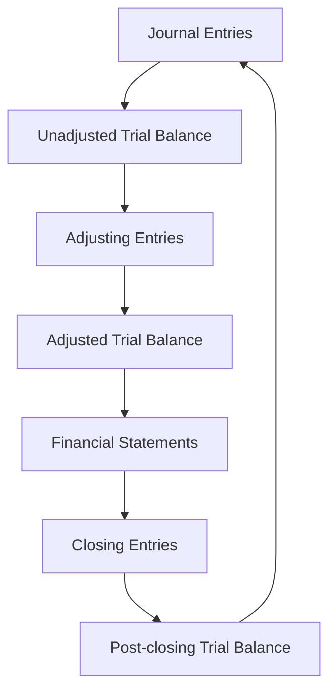

# Accounting Background

## Accounting cycle

## Types of account

Some accounts start each financial period with a balance of zero,
profit and loss accounts.

While others carry a balance from financial period to the next,
assets, liabilities, and capital.

Control accounts help to reconcile accounts,
debtor and creditor for example.

## Financial statements

### Statement of financial position - Balance sheet

Assets

- Cash
- AR
- Inventory

Capital

- Owners equity
- Retained earnings

Liabilities

- AP
- Wages payable
- Current portion of long-term debt
- Long-term debt

### Statement of financial performance - Income statement

Income

- Sales
- Other income

Expenses

- Cost of sales
- General and administrative
- Other expenses

### Statement of cashflows

## Checklists

- Sales invoices
- Purchase invoices
- Prepayments
- Accruals
- Wages
- Stock
- Depreciation
- Bank reconciliation
