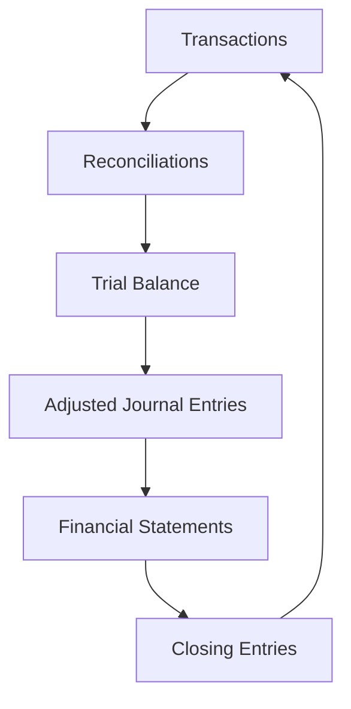
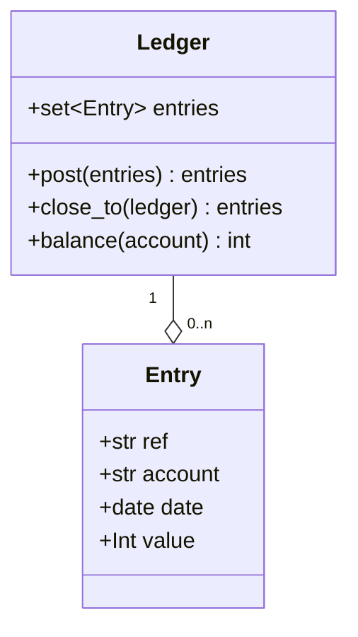
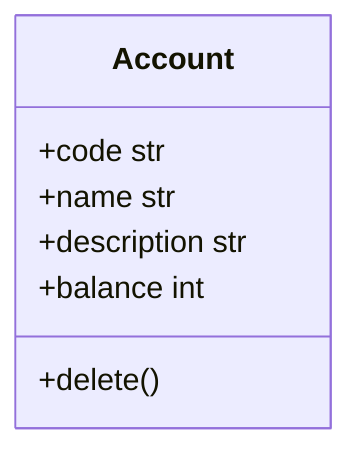

# Domain

## Ubiquitous Language

### Bookkeeping

Bookkeeping is all about creating an accurate paper trial.

??? note "Accounting methods"

    Two accounting methods, cash and accrual.
    The difference is when sales and purchases are recorded.
    Cash-based accounting records sales and purchases when cash exchanges hands.
    Accrual-based accounting recourds sales and purchases when they happen.
    All but the smallest businesses use accrual-based accounting.

A business has three financial concepts that must be kept in balance;
assets, capital, and liabilities.
Assets = capital + liabilities.

Every `transaction` requires at least one `debit` and one `credit`.
This is double-entry bookkeeping.

The `chart of accounts` sets out all a business' `account`s and the types of
`transaction`s that go into each one.

"The books" or "the accounts" are a collection of `ledger`s.

A `ledger` records groups of `debit`s and `credit`s. For example,

- Sales `ledger`: customer accounts
- Purchase `ledger`: supplier accounts
- General `ledger`: ultimately, all business activities
- Bank `ledger`: bank account inflows and outflows

The information recorded in bookkeeping is ultimately used to create financial
statements.

The statement of financial position shows a snapshot in time of the value of
assets, capital, and liabilties.

The statements of financial performance shows a window of time of the value of
income and expenses.

Bookkeeping follows the accounting cycle over a period of time.

To "close" the accounts means to zero out all the income and expense accounts.

Different types of account have different "normal" balances.

| Account | Normal balance|
| --- | --- |
| Asset | Debit |
| Capital | Credit |
| Liability | Credit |
| Income | Credit |
| Expense | Debit |

A debit normal balance means debiting that account increases the value.

The `chart of accounts` records which types of `transaction`s should affect
which `account`s.
It is probably in a specific order and includes a description for each account.

`Account`s can be added during the period but not removed.

Chart of accounts columns;

- Number
- Name
- Type (Asset, Capital, Liability, Income, Expense)
- Description of the types of `transaction`s to be recorded in that `account`

Historically, splitting the act of entering debits and credits onto
separate ledgers kept things simpler.
Debits and credits relating to sales were all recorded in one place then
the total sales for the period was entered in the general ledger.

`Control account reconciliations` help to check the various ledgers are in
agreement.

For example, the debtors control account totals all the sales and customer
receipts for a period.
This may be compared to the aged debtors report.

Not all debits and credits are the result of explicit transactions such as a
sale.
For example, assets depreciate in value and prepaid expenses such as insurance
are used up with time.

### Periodic tasks

Certain tasks need completing on a daily, weekly, or monthly basis.
Besides the annual financial statement preparation.

Businesses use checklists to keep track of which tasks have been completed
for the period.

### Preparing financial statements

### Tax

### Reporting

For decision-making...

For external parties...

### Budgeting

## Bounded Contexts

The same words may have different meanings inside each context or system.

### Ledger system

"Posting" debits and credits to ledgers

  - Ensuring "transactions" (grouped debits and credits) "balance" (sum to zero)
  and are idempotent.
  - Implenting logic of "closing" one ledger to another.
  - Calculate account balances at a given date.
  - Controls concurrent writes to a single ledger.

Much of the domain logic exists to enforce _constraints_
to maintain the _invariants_ of the system.
Invariants are things that have to be true whenever we finish an operation.

The two words are somewhat interchangeable,
but a constraint is a rule that restricts the possible states our model can get into,
while an invariant is defined a little more precisely as a condition that is always true.

Invariants

- Ledger balance must be 0.

Constraints

- Entries given to be posted to a ledger must sum to 0.
- Only one thread / process can alter a ledger at a time.

#### Implementation

`Ledger` is an entity and an aggregate. `Entry` is a value object.

???+ note "Debits, credit, and decimals"

    Debit and credit amounts are represented as positve and negative values
    respectively, while money amounts are in pence to avoid floating point
    number issues.

!!! tip

    For the purposes of the ledger system,
    the account number is taken as read.
    Some other system manages accounts as an entity in their own right.

### Chart of accounts

### Reporting system

Records groups of accounts.

Returns aggregate information - not concerned with debits and credits.

Includes control accounts and financial statements.

### Budgeting / Forecasting system

...
