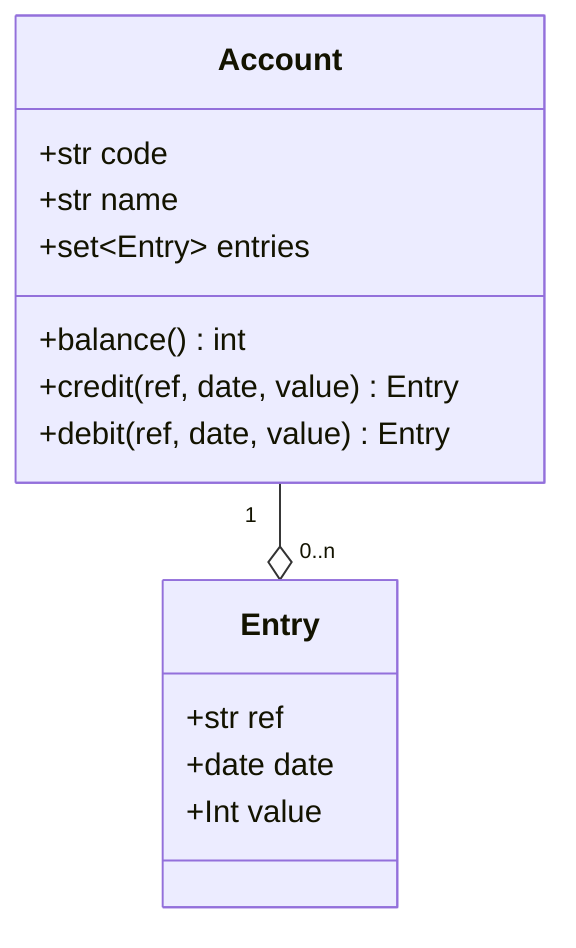

# Domain

???+ note "Debits, credit, and decimals"

    Debit and credit amounts are represented as positve and negative values
    respectively, while money amounts are in pence to avoid floating point
    number issues.
